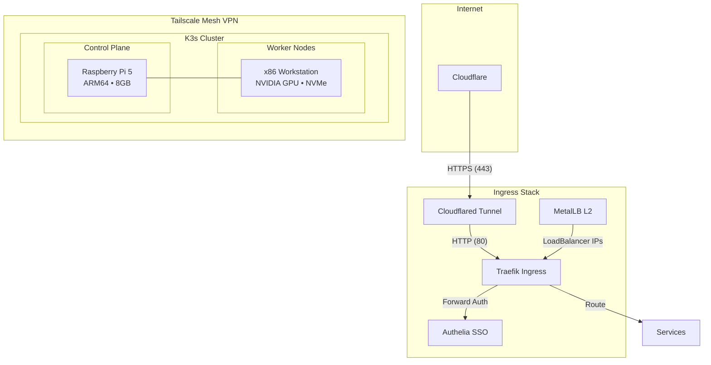

# Homelab Infrastructure

**Production-grade Kubernetes on bare metal** — A GitOps-managed K3s cluster running on Raspberry Pi and x86 nodes, featuring zero-trust networking, GPU workloads, and distributed storage.

## Architecture Overview



## Deployed Services

| Service | Role | Stack |
|---------|------|-------|
| **Traefik** | Ingress controller, reverse proxy, TLS termination | Go |
| **Authelia** | SSO, 2FA, forward-auth middleware | Go |
| **Cloudflared** | Zero-trust tunnel to Cloudflare edge | Go |
| **MetalLB** | Bare-metal LoadBalancer (L2 mode) | Go |
| **Longhorn** | Distributed block storage, snapshots, backups | Go |
| **Ollama + Open WebUI** | Local LLM inference with GPU acceleration | Python/Go |
| **OpenClaw** | AI agent framework with browser automation | Python |
| **STF** | Smartphone Test Farm — remote device control | Node.js |
| **Vaultwarden** | Self-hosted Bitwarden-compatible password manager | Rust |
| **PostgreSQL** | Relational database for stateful services | C |
| **Stalwart** | Modern mail server (SMTP/IMAP/JMAP) | Rust |
| **SnappyMail** | Lightweight webmail client | PHP |
| **Klipper + Mainsail** | 3D printer firmware & web interface | Python/Vue |
| **Homarr** | Homelab dashboard | TypeScript |

## Infrastructure Patterns

### Secure Ingress Without Public IP

```
Internet → Cloudflare → Cloudflared Tunnel → Traefik → Services
                              ↓
                     (outbound-only connection)
```

All services are exposed through Cloudflare Tunnels — no inbound ports, no public IP required. Traefik routes requests internally and delegates authentication to Authelia via forward-auth middleware.

### Bare-Metal Load Balancing

MetalLB provides `LoadBalancer` service types on bare metal using L2 advertisements:

```yaml
# kubernetes/metallb/metallb.yaml
apiVersion: metallb.io/v1beta1
kind: IPAddressPool
spec:
  addresses:
    - 192.168.1.17-192.168.1.20
```

### Distributed Storage

Longhorn provides:
- Replicated block storage across nodes
- Scheduled snapshots and backups
- Storage classes for different durability requirements

### GPU Scheduling for ML Workloads

NVIDIA GPU exposed to Kubernetes via device plugin:

```yaml
# kubernetes/nvidia-device-plugin/device-plugin.yaml
nodeSelector:
  gpu: nvidia
# ...
resources:
  limits:
    nvidia.com/gpu: "1"
```

Ollama runs LLMs locally with GPU acceleration, scheduled exclusively on the GPU-equipped node via `nodeSelector` and taints/tolerations.

### Authentication Middleware Chain

Traefik uses a middleware chain for protected routes:

```yaml
secured:
  chain:
    middlewares:
      - https-headers
      - authelia  # Forward-auth to Authelia
```

Services like STF, Mainsail, and Open WebUI require authentication; public services (mail, webhooks) bypass it.

## Repository Structure

```
homelab/
├── kubernetes/           # K8s manifests (one folder per service)
│   ├── authelia/         # SSO & 2FA
│   ├── cloudflared/      # Cloudflare tunnel
│   ├── homarr/           # Dashboard
│   ├── klipper/          # 3D printer control
│   ├── longhorn/         # Distributed storage
│   ├── metallb/          # Load balancer
│   ├── nvidia-device-plugin/  # GPU support
│   ├── ollama/           # LLM inference
│   ├── openclaw/         # AI agent framework
│   ├── postgres/         # Database
│   ├── snappymail/       # Webmail
│   ├── stalwart/         # Mail server
│   ├── stf/              # Device farm
│   ├── traefik/          # Ingress
│   └── vaultwarden/      # Password manager
├── stf/                  # STF Kustomize overlays & ARM64 build
├── klipper/              # Klipper printer configs
├── scripts/              # Utility scripts
└── init/                 # Cluster bootstrap
```

## Quick Start

```bash
# 1. Clone and configure secrets
git clone https://github.com/your-username/homelab.git
cd homelab

# 2. Copy and fill secret templates
cp kubernetes/authelia/secrets.yaml.example kubernetes/authelia/secrets.yaml
cp kubernetes/cloudflared/secret.yaml.example kubernetes/cloudflared/secret.yaml
cp kubernetes/postgres/secrets.yaml.example kubernetes/postgres/secrets.yaml

# 3. Apply core infrastructure
kubectl apply -f kubernetes/metallb/
kubectl apply -f kubernetes/longhorn/
kubectl apply -f kubernetes/traefik/
kubectl apply -f kubernetes/authelia/
kubectl apply -f kubernetes/cloudflared/

# 4. Deploy services
kubectl apply -f kubernetes/ollama/
kubectl apply -f kubernetes/vaultwarden/
# ...
```

## Hardware

| Node | Role | Specs |
|------|------|-------|
| `rpi5` | Control plane + lightweight services | Raspberry Pi 5, ARM64, 8GB RAM |
| `sleeper` | GPU worker + storage | x86_64, NVIDIA GPU, NVMe SSD |

## Disclaimer

This is a **personal learning environment**, not a production system. It demonstrates:

- Kubernetes cluster management on heterogeneous hardware
- GitOps practices with declarative manifests
- Zero-trust networking patterns
- GPU workload scheduling
- Distributed storage on commodity hardware

Some configurations prioritize experimentation over high availability. Secrets management uses Kubernetes Secrets with `.gitignore` protection — for production, consider Sealed Secrets or external secret managers.

---

*Built with K3s, Traefik, Longhorn, and caffeine.*
